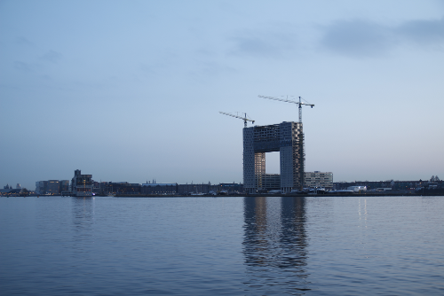
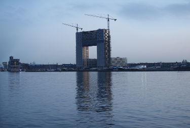

# Seam Carving
## Описание
Seam carving - это алгоритм для изменения размера картинки, сохраняющий важный контент и удаляющий менее значимый.
## Как использовать
1. Склонируйте репозиторий
2. Запустите main.kt
3. В аргументах программы задайте путь к png изображениям, которые хотите изменить.
## Результат

